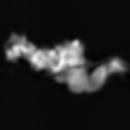

# spatial-VAE

Source code and datasets for [Explicitly disentangling image content from translation and rotation with spatial-VAE](https://arxiv.org/abs/1909.11663) to appear at NeurIPS 2019.


Learned hinge motion of 5HDB


Learned arm motion of CODH/ACS


## Bibtex

```
@incollection{bepler2019spatialvae,
title = {Explicitly disentangling image content from translation and rotation with spatial-VAE},
author = {Bepler, Tristan and Zhong, Ellen D. and Kelley, Kotaro and Brignole, Edward and Berger, Bonnie},
booktitle = {Advances in Neural Information Processing Systems 32},
year = {2019},
url = {https://arxiv.org/abs/1909.11663}
}
```


## Setup

Dependencies:
- python 3
- pytorch >= 0.4
- torchvision
- numpy
- pillow

## Datasets

Datasets as tarballs are available from the links below.

- [Rotated MNIST](http://bergerlab-downloads.csail.mit.edu/spatial-vae/mnist_rotated.tar.gz)
- [Rotated & Translated MNIST](http://bergerlab-downloads.csail.mit.edu/spatial-vae/mnist_rotated_translated.tar.gz)
- [5HDB simulated EM images](http://bergerlab-downloads.csail.mit.edu/spatial-vae/5HDB.tar.gz)
- [CODH/ACS EM images](http://bergerlab-downloads.csail.mit.edu/spatial-vae/codhacs.tar.gz)
- [Antibody EM images](http://bergerlab-downloads.csail.mit.edu/spatial-vae/antibody.tar.gz)
- [Galaxy zoo](http://bergerlab-downloads.csail.mit.edu/spatial-vae/galaxy_zoo.tar.gz)


## Usage

The scripts, "train\_mnist.py", "train\_particles.py", and "train\_galaxy.py", train spatial-VAE models on the MNIST, single particle EM, and galaxy zoo data.

For example, to train a spatial-VAE model on the CODH/ACS dataset

```
python train_particles.py data/codhacs/processed_train.npy data/codhacs/processed_test.npy --num-epochs=1000 --augment-rotation
```

Some script options include:
--z-dim: dimension of the unstructured latent variable (default: 2)
--p-hidden-dim and --p-num-layers: the number of layers and number of units per layer in the spatial generator network
--q-hidden-dim and --q-num-layers: the number of layers and number of units per layer in the approximate inference network
--dx-prior, --theta-prior: standard deviation (in fraction of image size) of the translation prior and standard deviation of the rotation prior
--no-rotate, --no-translate: flags to disable rotation and translation inference
--normalize: normalize the images before training (subtract mean, divide by standard deviation)
--fit-noise: also output the standard deviation of each pixel from the spatial generator network, sometimes called a colored noise model
--save-prefix: save model parameters every few epochs to this path prefix

See --help for complete arguments list.

